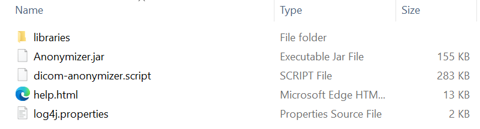

---
filename:
permalink:
date: 
---
[[TOC]]

Working with real patients data is a must when developping tools to be used in the medical domain. Having access to data also means one is bound to confidentiality, and has to ensure patient's privacy. 
The RSNA has recently made available their tool called Anonymiser. It's a free open-source software to de-identify DICOM images based on the [Data De-identification Protocol](). A TL/DR version of it is that the settings can be split in two groups:  
- **Basic Application Confidentiality:** This is the very strict version that would remove all protected health information (PHI) from the DICOM
- **Options to retain certain PHI:** like the device identity, Patient's age or sex etc.. This is done by relaxing some of the parameters in the first category (Note that some of the PHI cannot be retained in the current version of the software)

Let's see how to setup the tool and get your dataset de-identified.
https://www.rsna.org/-/media/Files/RSNA/Covid-19/RICORD/RSNA-Anonymizer-Program-Instructions.pdf

!!! info
        I am only going to explain how to anonymize data from a folder with the Basic Application Confidentiality setups.  
        However,the software allows for database queries and direct imports. All the details are available in the user guide.

### Step 1: Download and install the DICOM Anonymizer Program

You can either use the [direct download link](http://mirc.rsna.org/download/Anonymizer-installer.jar
) or select the correct software in [this list](http://mirc.rsna.org/download). The software works regardless of the Os, as long as you can have Java installed.

Run the installer and select the folder where you want the software to be installed. The folder structure should look like this:  

Click on the Anonymiser.jar to run the software

### Step 2: Set up a storage directory

On the *Directory* tab, click on the `set storage directory` button in the lower left corner of the left pannel and select the folder where you want your anonymised images to sit.

### Step 4: Import your data into the software

This will require you to

1. Define the extension type of your data  

2. Point to the data directory

On the same *Directory* tab, the right panel lets point to the correct directory in a specific disk (or partition). You can change the partition to explore in the selection space right under *Directory*.

!!! tip Tip
        If you ever need to add an extension to all your images or batch change the extension, check out my [post]("_posts/_til/batchrename").
Dd
